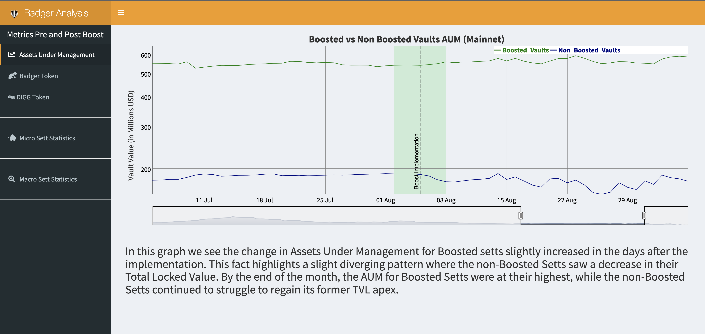

# A Badger Boost Exploratory Analysis

Our Gitcoin Grants Round 11 Badger Hackathon Submission

The introduction of BadgerDAO’s Boost staking incentive program has been met with not only excitement, but a need for the larger community to understand how this initiative has affected key performance metrics. Utilizing data directly from Badger’s data API, we compiled a series of statistics and visualizations that highlight the moderate, but positive impact the Boost program has had to the platform’s TVL and its token prices. Our tool also allows interested users to zoom into individual Sett vaults to see the effects, pre- and post- boosting. For completeness, we compiled generalized statistics about the Setts as a whole and included visualizations that allow for the quick comparison of size across each.

Check out the video demo [here](https://youtu.be/R2w2uUSsi7g).
Play with the app [here](https://crypto.omnianalytics.io/apps/git-11-badger-boost/).

## About Us

Omni Analytics Group is an incorporated group of passionate technologists who help others use data science to change the world. Our practice of data science leads us into many exciting areas where we enthusiastically apply our machine learning, artificial intelligence and analysis skills. Our flavor for 2021, the blockchain! To learn more about what we do or just to have fun, join us over on Twitter.
